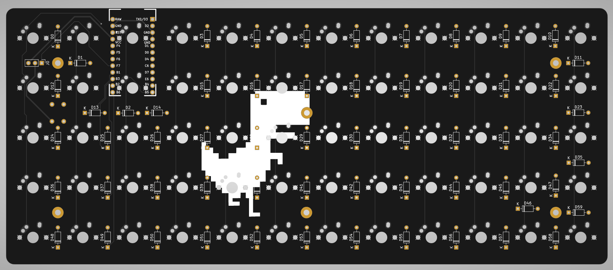

# T-Rex

A 5x12 Ortholinear qmk compatible Keyboard. The Keyboard only uses through hole components.

BOM:
* [Controller](https://splitkb.com/products/pro-micro-atmega32u4-5v-16mhz)
* [Diodes](https://splitkb.com/products/tht-diodes)

