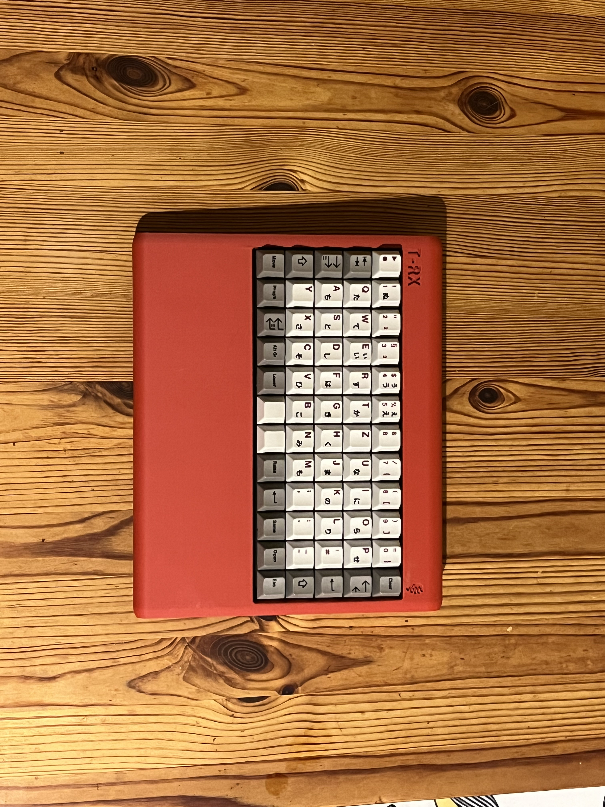
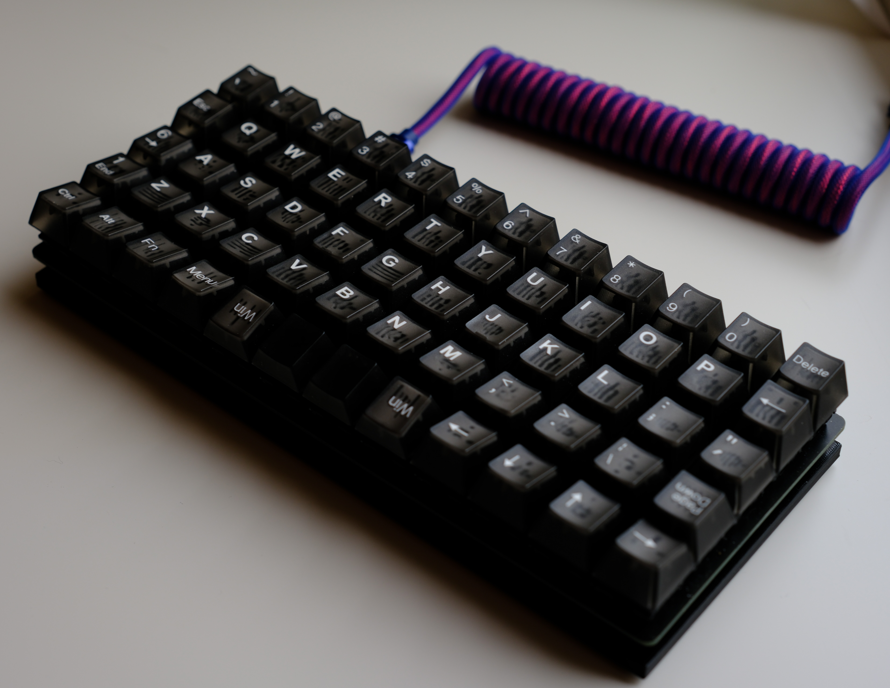

# T-Rex

A 5x12 Ortholinear QMK and ZMK compatible Keyboard. The keyboard is designed to be easily ordered by anyone from a PCB manufacturer and assembled by yourself. It is compatible with Pro Micro controllers and their derivatives. Additionally, it supports WS2812 LED strips as an extra feature. The keyboard comes with an assortment of 3D printable cases and can be assembled with easily available parts. 

QMK Firmware is currently only on this fork of [qmk](https://github.com/SylivanKenobi/qmk_firmware/tree/master/keyboards/t_rex). 

The [ZMK](https://github.com/devilzmods/trex_shield_module) implementation supports Bluetooth and ZMK Studio with [compatible controllers](https://zmk.dev/docs/hardware#pro_micro). 

Example parts:
* [QMK Controller](https://splitkb.com/products/pro-micro-atmega32u4-5v-16mhz)
* [ZMK Controller (Wireless)](https://de.aliexpress.com/item/1005007266112508.html)
* [Diodes](https://splitkb.com/products/tht-diodes)
* [Reset button](https://mechboards.co.uk/products/reset-switches?variant=40823623090381)
* 60 Switches
* 60 Keycaps
* 6x [M2x8 Standoffs](https://splitkb.com/products/brass-m2-spacers?variant=42396969173251)
* 3D printed case([stl file](cases/minimal-case.stl))
* 6x M2x10 screws, 6x M2x5 screws

## Assembly

### PCB

1. Solder diodes on top of board, orientation is marked by silkscreen
1. Clip diode leftovers
1. Solder controller headers and reset button
1. Solder switches
1. Solder controller
1. [Flash QMK](https://github.com/SylivanKenobi/qmk_firmware/tree/master/keyboards/t_rex)
1. [Or ZMK](https://github.com/devilzmods/trex_shield_module) - Download the latest working .uf2 file under the 'actions' tab, put the board into its bootloader by double tapping reset and copy the firmware file onto the controller.
1. For wireless, solder a battery (3,7V LiIon) or battery connector and power switch to the battery pins on the nice!nano.

> If you socket your controller, mount the controller before the switches and test the PCB.

### Cases

#### Minimal Case

1. Print [case](cases/minimal-case.stl) with 3d printer
1. Mount standoffs with M2x5 from the top
1. Mount case with M2x10 to standoffs

#### Closed Case

1. Print the case, depending on printer size you can either use the regular or the split version of the case.([case files](cases/closed-falt-case)) 
1. Insert M2x4x3.5 Heat set inserts([exapmle](https://www.bastelgarage.ch/gewindeeinsatze-messing-insert-set-360-stuck))
1. Mount pcb to case with M2x5 screws

#### Slab Case

1. Print the case, the .3mf file includes bodies for the lettering and Logo that can be colored for multicolor printing, removed for embossed text or ignored to fill the text in. Make sure the lid body sits flush on the build plate or print it separately. Only the main  Tray area of the case needs support, the battery cover can be printed in place as built-in support and popped out.[case file](cases/slabcase.3mf)
1. After printing remove the support and carefully break free the battery cover
1. Fill the case with your Medium of choice. Sand with a grain size of <2mm is recommended, other options include cement and plaster. The internal volume of the case is rougly .7 liter. Glue the lid on top and make sure it's tight in case your medium could spill out.
1. Mount 8mm standoffs to PCB with M2x5/6 from the top
1. Mount case with M2x5/6 to standoffs, if applicable route the battery connector wire into the battery tray.

## Plate

I would recommend using PCB-Mounted switches for this board. There is a 3d printable plate for the t-rex in this repo([file](cases/plate.stl)). The plate works but because it's 3d printed it's not that great.

## Customizing Firmware

ZMK Studio allows on the fly remapping of your keyboards keymap, similar to via/vial. For more in-depth configuration you can follow the (ZMK Customization Guide)[https://zmk.dev/docs/customization] to create your own config repo and add the (T-Rex Shield Module)[https://github.com/devilzmods/trex_shield_module]

## Roadmap

1. Merge firmware to QMK

